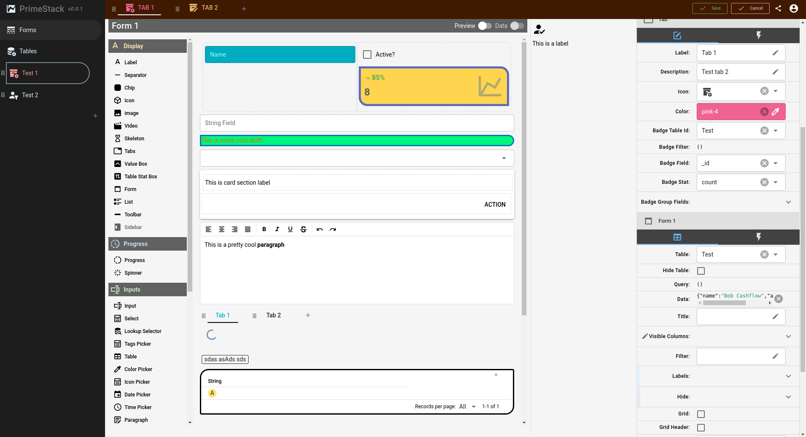

# PrimeStack

PrimeStack is an online software as a service which allow you build complex business or personal softwares with little to no coding. Using a visual form builder and a powerful properties editor, you can design user interfaces very efficiently and in little time.

The project is structured as a mono-repo to ease development allowing devs to easily modify and run both, the frontend and backend, using one setup.  



<!-- TOC -->
* [PrimeStack](#primestack)
  * [Technologies and version requirements](#technologies-and-version-requirements)
  * [Setup & Installation](#setup--installation)
  * [Main folders](#main-folders)
<!-- TOC -->

## Technologies and version requirements

| Name        | Minimum version | 
|-------------|-----------------|
| NodeJs      | v16             |
| Yarn        | v1.22+          |
| MongoDB     | v6              |
| Vue         | v3              | 
| Feathers.js | v5              |
| Typescript  | v5.1            |

## Setup & Installation
The install bash script file will setup the shared symlinks and install the required packages in both, the backend and frontend folders.

```bash
./install.sh
```

## Main folders

| Folder                               | Description                             |
|--------------------------------------|-----------------------------------------|
| [Shared](./shared/docs/index.md)     | Shared interfaces, schemas, ...         |
| [Backend](./backend/docs/index.md)   | Node + Feathers backend                 |
| [Frontend](./frontend/docs/index.md) | Vite + Vue 3 + Feathers-Pinia  frontend |
